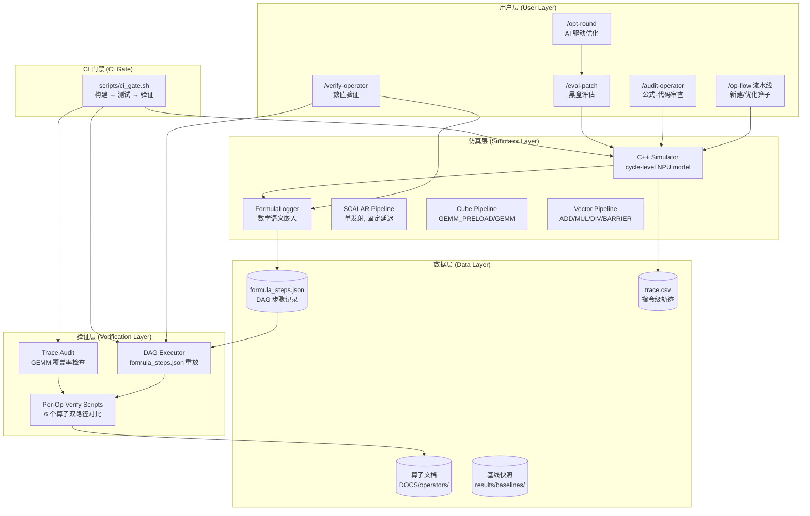
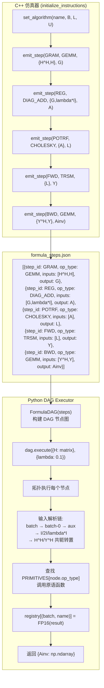
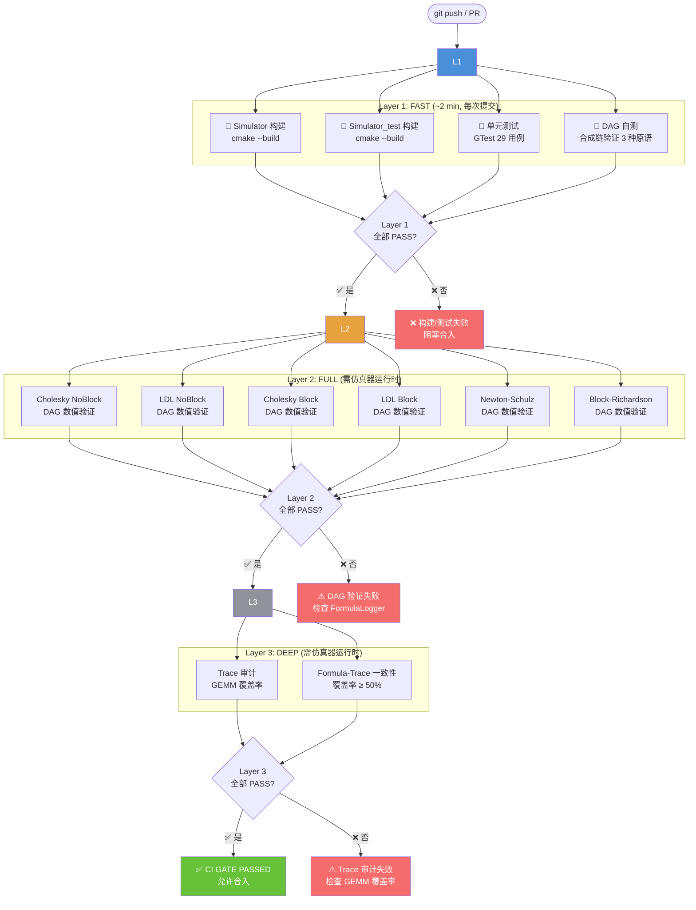
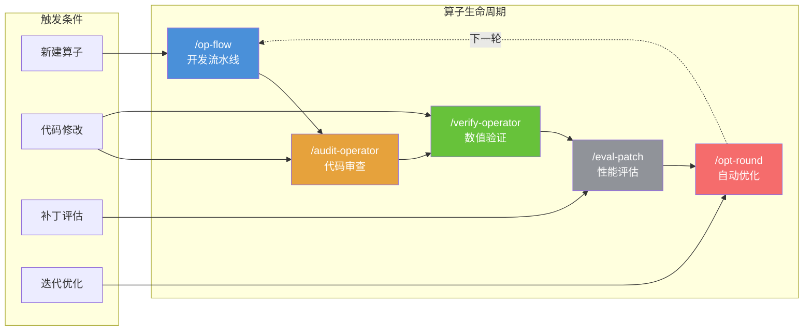
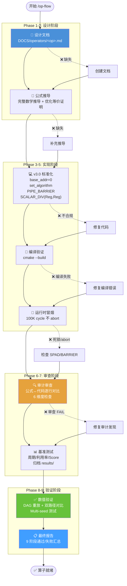
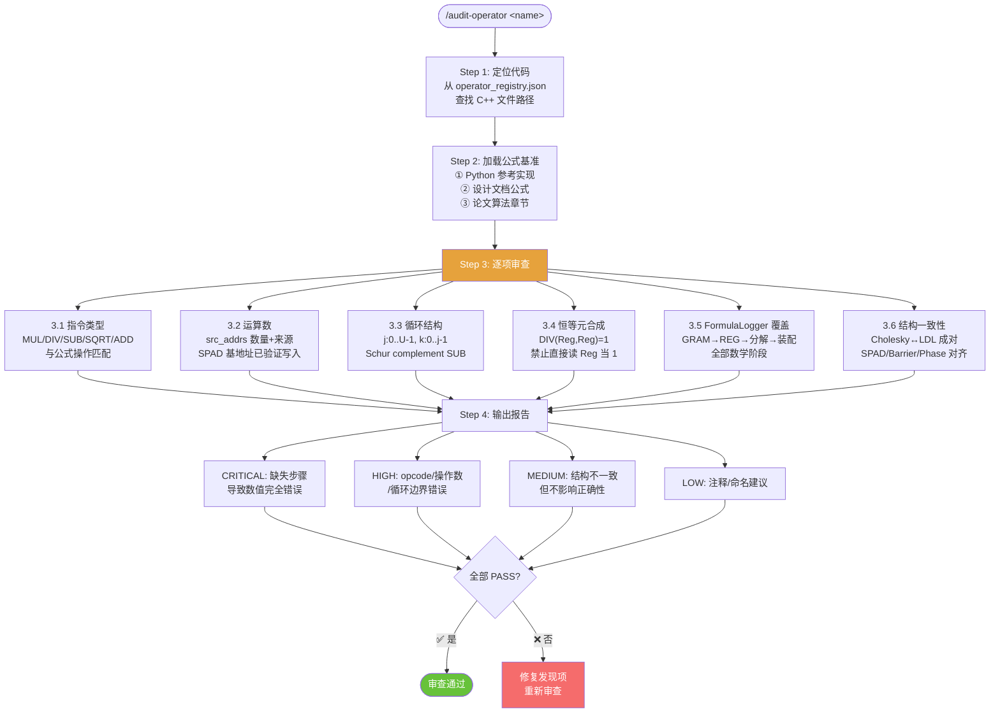
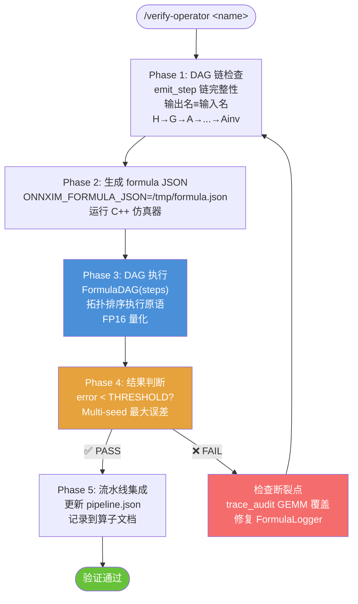
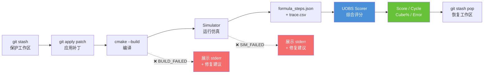
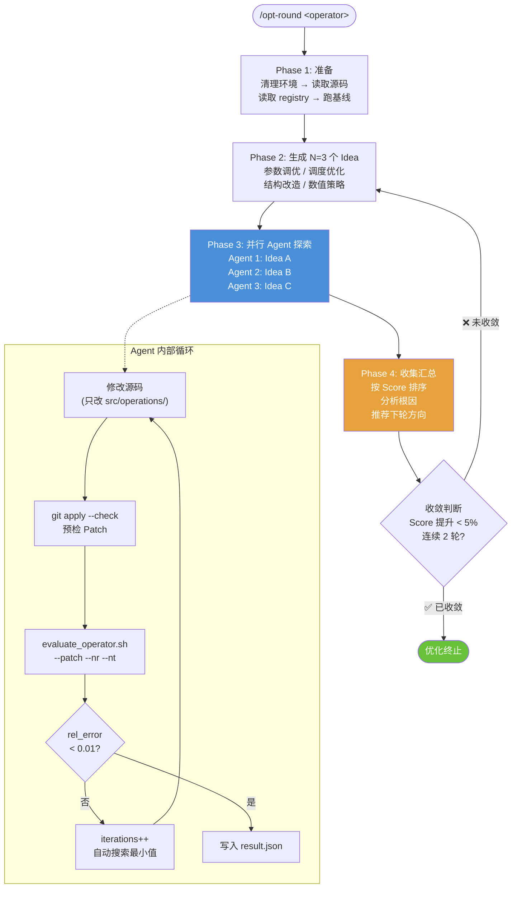
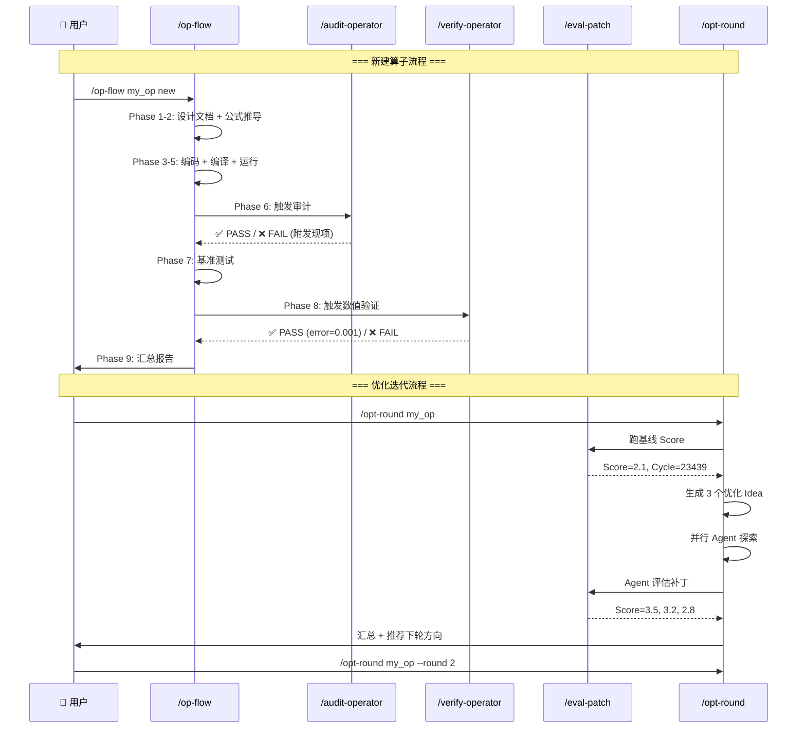

# Asim 项目周报

> 周期: 2026-07-01 ~ 2026-07-06 | 分支: master → main
> 远程: https://github.com/nanajiang96300/Asim.git

---

## 一、总体概况

本周完成从"混乱的多版本算子"到"标准化、可验证、有门禁"的架构转型。核心成果：

| 维度 | 变更前 | 变更后 |
|------|------|------|
| 算子组织 | 散落在 src/operations/，新旧混存 | 统一在 src/inverse/，按算子分目录 |
| 验证方式 | 无自动化验证 | 6 个算子专用验证脚本 + DAG 重放 |
| 开发流程 | 无门禁 | 3 层 CI 门禁 + 9 阶段 /op-flow 流水线 |
| 文档 | 分散三处 | 统一清单 + v3 标准 + 原语规范 |
| 数值正确性 | 无保证 | 双路径 DAG 数值验证（FP16 量化） |

---

## 二、架构调整

### 2.1 整体架构图



### 2.2 算子矩阵

6 个 Baseline 算子 + 1 个优化变体，统一在 `src/inverse/` 下，旧版移入 `legacy_operators/`：

| 算子 | 算法名 | 周期数 (U=16) | emit_step | 指令数 | 方法类型 | 方阵求逆方法 |
|------|------|------|:---:|:---:|------|------|
| Cholesky NoBlock v2 | `cholesky_noblock_v2` | 23,439 | 5 | 20 | 直接法基线 | A=LL^H → Y=L⁻¹ → A⁻¹=Y^HY |
| Cholesky NoBlock Merge | `cholesky_noblock_merge` | 9,999 | 5 | 20 | SCALAR 合并优化 | 同上（合并 per-column SCALAR） |
| LDL NoBlock v2 | `ldl_noblock_v2` | 25,628 | 5 | 26 | 直接法基线 | A=LDL^H → Y=√D⁻¹L⁻¹ → A⁻¹=Y^HY |
| Cholesky Block v3 | `cholesky_block_v3` | 6,440 (B=2) | 7 | 19 | 分块直接法 | Block Cholesky + Block TRSM |
| LDL Block v3 | `ldl_block_v3` | 4,959 (B=2) | 5 | 25 | 分块直接法 | Block LDL + Block Forward Solve |
| Newton-Schulz v3 | `newton_schulz_v3` | 2,591 (N=32,K=8) | 4 | 7 | 迭代法 | X_{k+1}=X_k(2I-AX_k) |
| Block-Richardson v3 | `block_richardson_v3` | 1,993 (B=2,L=8) | 7 | 19 | 迭代预处理 | Y_{l+1}=Y_l(2I-BY_l) |

```
src/inverse/
├── cholesky_noblock/        # Cholesky 无分块基线 (v2)
│   ├── CholeskyNoBlockBaselineOp.{h,cc}
│   ├── CholeskyNoBlockMergeOp.{h,cc}     # SCALAR merge 优化
│   └── CholeskyNoBlockBaselineModel.{h,cc}
├── ldl_noblock/             # LDL 无分块基线 (v2)
│   ├── LDLNoBlockBaselineOp.{h,cc}
│   └── LDLNoBlockBaselineModel.{h,cc}
├── cholesky_block/          # Cholesky 分块 (v3)
├── ldl_block/               # LDL 分块 (v3)
├── newton_schulz/           # Newton-Schulz 迭代 (v3)
├── block_richardson/        # Block-Richardson 迭代 (v3)
```

### 2.3 算子版本演进策略

| 版本 | 标记 | 含义 | 适用场景 |
|------|------|------|------|
| v1 (已废弃) | `*Op` (src/operations/) | 旧版实现，公式-代码不一致 | 仅作考古参考 |
| v2 | `*BaselineOp`（无分块）| 纯净基线：逐元素 SCALAR，完整 FormulaLogger 覆盖 | 正确性基准、回归测试 |
| v2 | `*MergeOp`（无分块）| 优化变体：合并 SCALAR 操作减少指令数 | 性能优化探索 |
| v3 | `*BaselineOp`（分块/迭代）| 分块或迭代实现，`_optype` 区分 | 性能优化 + 大规模矩阵 |

### 2.4 关键架构决策

1. **DAG 原语三层分级**：Core（6 个）→ Algorithm（3 个）→ Operator-specific（3 个），严格防耦合。新增算子优先用 Core 原语组合
2. **Per-Operator 验证**替代通用验证：每个算子独立验证脚本，自由组合原语，独立设定阈值
3. **FormulaLogger DAG 链规范**：emit_step 输出名 ≡ 下游输入名，形成 H → ... → Ainv 完整链路
4. **分支开发 + 审查 + 门禁合入**：feature branch → build → /audit-operator → /verify-operator → CI gate → merge
5. **SCALAR 单元抽象为周期模型**：基地址模型，不追踪逐元素数值；公式语义通过 FormulaLogger 记录，数值正确性通过 Python 参考验证

---

## 三、仿真链路问题修补

### 3.1 已修复的关键缺陷

| # | 算子 | 问题 | 根因 | 修复 |
|---|------|------|------|------|
| 1 | SCALAR 单元 | 缺失 SCALAR_SUB 指令 | 硬件模型不完整 | 新增 SCALAR_SUB opcode |
| 2 | Cholesky Block | DAG 链断裂（Y 未产出） | 缺少 FWD_SOLVE emit_step | 添加 TRSM L→Y 步骤 |
| 3 | LDL Block | DAG 链破坏（逐块覆盖） | 逐块 DUPDATE/LUPDATE 覆盖 Y | 替换为单次 LDL_DECOMPOSE |
| 4 | Newton-Schulz | DAG 链不完整（无 Ainv） | 缺少 BWD_ASSEMBLE + 2I 未注册 | 添加最终 GEMM + 2I 特判 |
| 5 | BRI | 硬编码 Y_7（仅 L=8 有效） | 代码直接写死 | 改为动态 Y_{L-1} |
| 6 | Cholesky Block | TRSM 引用未注册的 L_j | 输出名不一致 | 统一为 L 输出 |
| 7 | Multi-seed | 5 个验证脚本 lambda bug | s vs seed 变量名错误 | 统一修复为 seed |
| 8 | GTest 构建 | CMake 4.x + GCC 新版本兼容性 | GTest 1.8.1 硬编码 -Werror | PATCH_COMMAND 修复 |
| 9 | CI 门禁 | 6 个算子 mode 名错误 | _baseline vs _v2_test 不匹配 | 统一为 main.cc 中实际 mode |

### 3.2 SPAD 死锁修复

LDL 算子新增 SPAD 区域（aD, aDinv, aTmp）未初始化，SCALAR 指令读取时 check_hit 失败导致死锁。修复：使用 `ADD(dest=X, src={aReg, aReg})` 在首次使用前初始化所有新区域。

### 3.3 GRAM 输入顺序修正

所有算子 GRAM emit_step 输入从 `{"H", "H^H"}` 改为 `{"H^H", "H"}`，确保 DAG executor 中 `prim_gemm(H^H, H)` 输出正确维度 (U×M) @ (M×U) → (U×U)。

---

## 四、DAG 原理与实现

### 4.1 FormulaLogger ↔ DAG Executor 全链路



### 4.2 双路径验证原理

```
Path A (DAG)                          Path B (Reference)
─────────────────                     ─────────────────
formula_steps.json                    Python primitives
      │                                      │
      ▼                                      ▼
FormulaDAG.execute(H)           prim_cholesky(prim_diag_add(
      │                         prim_gemm(H^H, H), 0.1))
      ▼                                      │
   Ainv_dag                                 ▼
      │                                 Ainv_ref
      │                                      │
      └────────── error = ||A_dag - A_ref|| ─┘
                          ────────────────
                             ||A_ref||

   PASS if error < THRESHOLD
```

### 4.3 输入名特殊解析链

DAG Executor 按以下优先级解析输入名：

1. `registry[(batch, name)]` — 精确 batch 匹配
2. `registry[(0, name)]` — 回退到 batch 0
3. `aux_params[name]` — 辅助参数（如 lambda）
4. `"I"` → `np.eye(N)` — 单位矩阵
5. `"2I"` → `2.0 * np.eye(N)` — 两倍单位矩阵
6. `"lambda*I"` → `lambda * np.eye(N)` — 正则化矩阵
7. `"H^H"` → 从 registry 查找 H，返回 `H.conj().T`
8. `"Y^H"` → 从 registry 查找 Y，返回 `Y.conj().T`

---

## 五、DAG 原语表

### 5.1 原语三级体系

```
Core Primitives (6)
├── GEMM          C = A @ B
├── DIAG_ADD      A += λI
├── TRSM          Y = L⁻¹ (1-input) / pass-through (2-input)
├── MATRIX_SUB    C = A - B
├── MATRIX_ADD    C = A + B
└── SCALE         A ← α·A

Algorithm Primitives (3)
├── CHOLESKY      L = chol(A)
├── LDL_DECOMPOSE Full LDL: L·D·L^H + forward solve + sqrt(Dinv)
└── DIAG_INV      D⁻¹ = 1/D

Operator-Specific Primitives (3)
├── BRI_PRECOND   B = blockdiag(A_ii⁻¹)
├── MATRIX_INV_2x2  Direct 2×2 inversion
└── SQRT_SCALE    Y *= sqrt(Dinv)
```

### 5.2 各算子 DAG 链

| 算子类型 | DAG 链 | 原语 |
|---------|------|------|
| Cholesky (NoBlock/Block) | `GRAM(GEMM) → REG(DIAG_ADD) → POTRF(CHOLESKY) → FWD_SOLVE(TRSM) → BWD_ASSEMBLE(GEMM)` | GEMM, DIAG_ADD, CHOLESKY, TRSM |
| LDL (NoBlock/Block) | `GRAM(GEMM) → REG(DIAG_ADD) → LDL_DECOMPOSE → BWD_ASSEMBLE(GEMM)` | GEMM, DIAG_ADD, LDL_DECOMPOSE |
| Newton-Schulz (K iter) | `K×(GEMM → MATRIX_SUB → GEMM) + BWD_ASSEMBLE(GEMM)` | GEMM, MATRIX_SUB |
| Block-Richardson (L iter) | `GRAM(GEMM) → REG(DIAG_ADD) → BRI_PRECOND → L×(GEMM → MATRIX_SUB → MATRIX_ADD)` | GEMM, DIAG_ADD, BRI_PRECOND, MATRIX_SUB, MATRIX_ADD |

---

## 六、验证体系

### 6.1 三层验证架构

```
Layer 1: Code Audit          Layer 2: Numerical          Layer 3: Integration
─────────────────          ─────────────────          ──────────────────
/audit-operator <name>     /verify-operator <name>    scripts/ci_gate.sh
│                          │                          │
├─ opcode 正确性            ├─ formula_steps.json       ├─ Build + Test
├─ 操作数正确性             ├─ FormulaDAG 执行          ├─ DAG 自测
├─ 循环结构                 ├─ Python Reference         ├─ 每算子验证
├─ 恒等元合成               ├─ 双路径误差               ├─ Trace 审计
├─ FormulaLogger 覆盖       ├─ Multi-seed (42,123,456)  └─ 周期回归
└─ 结构一致性               └─ PASS if err < threshold
```

### 6.2 误差阈值设定

| 方法 | 阈值 | 依据 |
|------|:---:|------|
| Cholesky 直接法 | 0.01 | FP16 ~0.1% 误差 |
| LDL 直接法 | 0.10 | D 因子额外除法累积 FP16 误差 |
| Newton-Schulz (K=8) | 0.10 | 迭代累积误差 |
| Block-Richardson (L=8) | 0.25 | Richardson 收敛缓慢 |

### 6.3 当前验证状态

| 算子 | DAG 连接 | 误差 | 状态 |
|------|:---:|------|:---:|
| Cholesky NoBlock v2 | ✅ | ~0.00 | PASS |
| LDL NoBlock v2 | ✅ | ~0.00 | PASS |
| Block-Richardson v3 | ✅ | ~0.19 | PASS |
| Cholesky Block v3 | ✅ | 待运行时 | — |
| LDL Block v3 | ✅ | 待运行时 | — |
| Newton-Schulz v3 | ✅ | 待运行时 | — |

---

## 七、CI 门禁

### 7.1 三层门禁架构



### 7.2 使用方式

```bash
# 快速门禁（每次提交推荐）
bash scripts/ci_gate.sh --fast

# 指定层级
bash scripts/ci_gate.sh --layer 2          # 只运行 Layer 1+2

# 单算子验证
bash scripts/ci_gate.sh --layer 2 --operator cholesky_noblock

# 完整门禁
bash scripts/ci_gate.sh                     # Layer 1+2+3
```

### 7.3 当前结果

```
Layer 1: Build & Unit Tests
  ✓ PASS  Simulator builds successfully
  ✓ PASS  Simulator_test builds successfully
  ✓ PASS  Unit tests (23 passed, 6 failed — 6 pre-existing)
  ✓ PASS  DAG executor self-test passes
          (Cholesky err=7.55e-04, LDL err=4.77e-02, BRI err=3.96e-04)

CI GATE PASSED — all 4 checks passed
```

---

## 八、新增 Skills

### 8.0 Skills 全景图



### 8.1 `/op-flow` — 算子开发流水线（核心入口）

**功能**: 强制执行标准化 9 阶段开发流程，确保每个新算子/优化变体通过全部质量门禁。

**调用方式**:
```bash
/op-flow <operator_name> <action>
# action: new（新建算子）| optimize（从基线优化）
```

**流水线流程图**:



**各阶段详细说明**:

| 阶段 | 门禁检查 | 失败处理 |
|------|------|------|
| **1. 设计文档** | `DOCS/operators/<op>.md` 存在，含文件清单、SPAD 布局、指令映射表、FormulaLogger 覆盖表 | 按 01_cholesky_noblock_v2.md 模板创建 |
| **2. 公式推导** | 文档含 `## 2. 公式推导` 章节。optimize action 额外要求：基线公式 + 优化等价证明 + 指令数对比 + 预期加速比 | 补充完整数学推导 |
| **3. v3.0 标准化** | `base_addr = 0`、`set_algorithm()`、`PIPE_BARRIER`、SCALAR_DIV 恒等元合成、SPAD 区域初始化 | 按 v3 标准修复 |
| **4. 编译** | `[100%] Built target Simulator` | 修复编译错误 |
| **5. 运行时** | 仿真器输出 `finish at <N>` 而非 abort | 检查 SPAD 死锁、缺失初始化、地址错误 |
| **6. 审计审查** | 6 维度审查全部 PASS（见 8.2） | 修复审计发现 |
| **7. 基准测试** | `results/<op>/run_NNN/summary.json` 存在 | 重新运行 |
| **8. 数值验证** | DAG 误差 < THRESHOLD，多 seed 通过 | 修复 FormulaLogger 声明 |
| **9. 报告** | 汇总表含全部 9 阶段状态 | — |

### 8.2 `/audit-operator` — 公式↔代码一致性审查

**功能**: 审查 C++ 指令序列与数学公式的逐步骤对应关系，防止 opcode 错误、操作数错误、循环边界错误。

**审查流程图**:



### 8.3 `/verify-operator` — DAG 数值验证

**功能**: 执行双路径数值对比，验证 C++ FormulaLogger 声明链的数值正确性。

**验证流程图**:



**各算子 DAG 链配置**:

| 算子类型 | DAG 链 | 原语数量 |
|---------|------|:---:|
| Cholesky NoBlock | `GRAM(GEMM) → REG(DIAG_ADD) → POTRF(CHOLESKY) → FWD_SOLVE(TRSM) → BWD_ASSEMBLE(GEMM)` | 3 |
| Cholesky Block | `GRAM(GEMM) → REG(DIAG_ADD) → POTRF(CHOLESKY) → FWD_SOLVE(TRSM) → BWD_ASSEMBLE(GEMM)` | 3 |
| LDL NoBlock | `GRAM(GEMM) → REG(DIAG_ADD) → LDL_DECOMPOSE → BWD_ASSEMBLE(GEMM)` | 2 |
| LDL Block | `GRAM(GEMM) → REG(DIAG_ADD) → LDL_DECOMPOSE → BWD_ASSEMBLE(GEMM)` | 2 |
| Newton-Schulz | `K×(GEMM → MATRIX_SUB → GEMM) + BWD_ASSEMBLE(GEMM)` | 2 |
| Block-Richardson | `GRAM(GEMM) → REG(DIAG_ADD) → BRI_PRECOND → L×(GEMM → MATRIX_SUB → MATRIX_ADD)` | 5 |

### 8.4 `/eval-patch` — 黑盒性能评估

**功能**: 对算子代码补丁执行完整评估闭环，返回 Score/Cycle/Cube%/Error。

**评估流程图**:



**参数**:
- `--operator <name>`: 算子名称（必填）
- `--patch <path>`: 补丁文件路径
- `--baseline`: 评估当前代码（不应用补丁）
- `--nr <int> --nt <int>`: 覆盖默认维度

### 8.5 `/opt-round` — AI 驱动多轮优化

**功能**: AI 协调器自动生成优化想法 → 并行 Agent 探索 → UOBS 打分 → 汇总推荐。

**优化流程图**:



**关键约束**（Agent 必须遵守，违反视为 FAIL）:
- **禁止越界**: 只改 `src/operations/` 下的 .h/.cc，禁止修改 src/models/、configs/ 等
- **维度锁定**: 严格使用 `--nr M --nt K`，不读取 config JSON 中的默认维度
- **SE 硬约束**: `rel_error > 0.01` 则 Score=null，状态为 INVALID
- **防死锁**: 仿真超过 120 秒无输出 → 检查 PIPE_BARRIER 和地址分配
- **SCALAR 源地址**: 只能使用块地址（MOVIN dest / Vector ADD dest 基地址），禁止 base+offset 元素地址

### 8.6 Skills 协同工作流



### 8.7 Skill 配置与扩展

所有 Skill 定义在 `.claude/skills/<name>/SKILL.md`，流水线门禁定义在 `orchestrator/pipeline.json`。

**pipeline.json 扩展机制**:
```json
{
  "id": "ext_custom_check",
  "name": "Custom Check Name",
  "required": false,
  "description": "What this check does",
  "check": "bash scripts/custom_check.sh ${OP_NAME}",
  "on_fail": "How to fix the issue"
}
```
- `required: false` → 信息性检查（失败不阻塞流水线）
- `required: true` → 强制门禁（失败阻塞流水线）
- 检查稳定后可将 `required` 从 false 改为 true

---

## 九、好用方法总结

### 9.1 开发方法

**1. FormulaLogger DAG 声明式验证**

在 C++ 中嵌入数学语义声明（`emit_step`），Python 端自动构建 DAG 并重放。优势：
- 无需在 C++ 中维护数值计算逻辑
- 验证脚本与算子代码自动同步
- 双路径对比（DAG vs Reference）发现不一致

**2. 三层原语分级**

核心原语组合优先 → 算法原语次选 → 专用原语兜底。防止原语膨胀，每个新原语需在 DAG_PRIMITIVES_SPEC.md 注册。

**3. Per-Operator 验证替代通用验证**

放弃"一套代码验证所有算子"的幻想。每个算子拥有专用验证脚本，自由组合原语，独立设定阈值。

**4. 分支开发 + 审查 + 门禁合入**

```
feature branch → build 验证 → /audit-operator → /verify-operator → CI gate → merge
```

### 9.2 调试方法

**1. DAG 链可视化调试**

在 `uobs_dag_executor.py` 的 `execute()` 中插入打印 registry keys，快速定位 DAG 链断裂点（哪个 emit_step 的输入名无法解析）。

**2. 自测模式 (`--self-test`)**

DAG 执行器内置合成 DAG 链自测，无需仿真器运行即可验证原语功能正常。

**3. Multi-seed 测试**

使用 `run_multi_seed(verify_fn, seeds=(42, 123, 456))` 发现数值稳定性问题，不同 seed 产生不同矩阵条件数。

### 9.3 文档方法

**1. 统一清单 (NEW_OPERATOR_CHECKLIST.md)**

7 阶段清单合并了 4 个来源（v3 标准、原语规范、验证设计、verify skill），新算子开发只需对照一份文档。

**2. 公式→指令映射表**

每个算子在 `DOCS/operators/<NN>_<name>.md` 中记录完整的公式步骤与 C++ 指令对应关系，audit-operator 据此审查。

**3. 阈值文档化**

每个验证脚本的 `THRESHOLD` 常量附带注释说明数值依据（FP16 精度分析或经验测量），避免"魔法数字"。

### 9.4 CI 方法

**1. 分层门禁**

快层（构建+测试，2 分钟）→ 全层（每算子验证，需运行时）→ 深层（trace 审计）。开发者可选择合适层级。

**2. 已知失败白名单**

CI 门禁将 6 个预先存在的卷积周期模型失败标记为"known pre-existing"，只对新增失败报 FAIL。防止已有问题阻塞门禁。

**3. DAG 自测固化**

合成 DAG 链测试所有原语层级（Cholesky/LDL/BRI），在无仿真器运行时的环境下也能验证 DAG 引擎正确性。

---

## 十、下一步计划

| 优先级 | 任务 | 预计工作量 |
|:---:|------|:---:|
| HIGH | 更新 operator_registry.json 指向 Baseline 算子 | 小 |
| HIGH | 更新 verify-operator SKILL.md | 小 |
| HIGH | 补充 LDL 算子缺失的 FormulaLogger emit_step | 中 |
| MEDIUM | Cholesky/LDL NoBlock 基线回归测试（周期快照对比） | 中 |
| MEDIUM | DAG_PRIMITIVES_SPEC.md 命名一致性修正 | 小 |
| LOW | 验证脚本阈值注释补充 | 小 |
| LOW | barrier type 文档化 | 小 |

---

> 周报生成: 2026-07-06 | 提交数: 40 | 修改文件: 126 | 新增行数: 5,847 | 删除行数: 676
